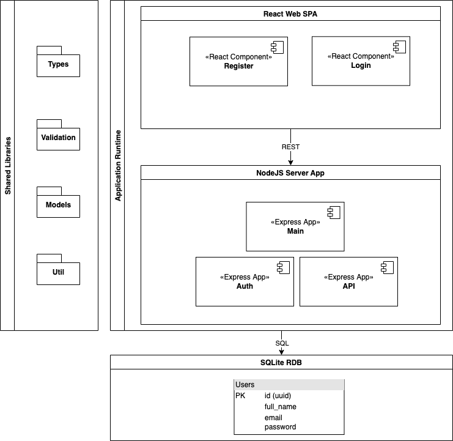

# Rationale
Build a modular React/Express app with a simple authentication.

# Commands
### Fullstack development**
``` npm run dev ```
### Frontend development
``` npm run front-dev ```
### Backend development
``` npm run back-dev ```
### DB Migrations
``` npm run migrate ```

# Application Architecture



# Reasoning
## Backend
### NPM workspaces
New NPM feature allows to start with a simple monorepo approach and divide the application modules to local packages without extra effort to manage the versioning and keeping updated and rebuilt in dev mode.

We divide the application code to `apps/` and `/libs` (similar to NX monorepo approach), stand for *Application Runtime* and *Shared Libraries*, respectively.

### API and Auth modules separation
We define Auth as a separate module apart of other application logic, in order to be able to federate it and/or use it on proxy layer in future.

### Database
We use SQLite relation database for a quick start, that will be replaced with other DB, one or multiple, per service. For now we outline the tables are used for specific services and trying to keep them in isolated schemas.

We use [Knex](https://knexjs.org/) query builder to quickly write and chain query clauses and filtering options.
We don't use any of ORMs in order to keep the control on SQL queries until we have the complexity drastically growing. In future, it can be replaced with (Objection.js)[https://vincit.github.io/objection.js/] or (TypeORM)[https://typeorm.io/#/].

We use UUID for identifying entities, in order to avoid possible collisions when we extract those into separate databases.

### Forms and validation
We use Formik library for a simple state management within forms validation schema is shared across frontend and backend and has been a single source of truth for both.

### State management
We don't use any state management until we need it. For the next step, we will
